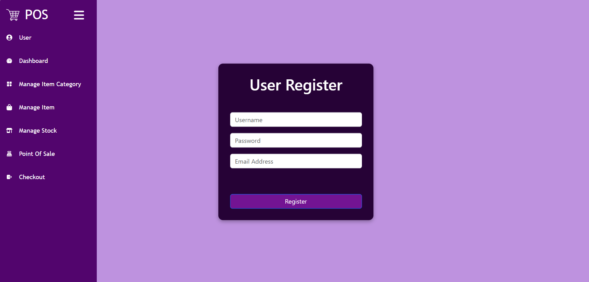
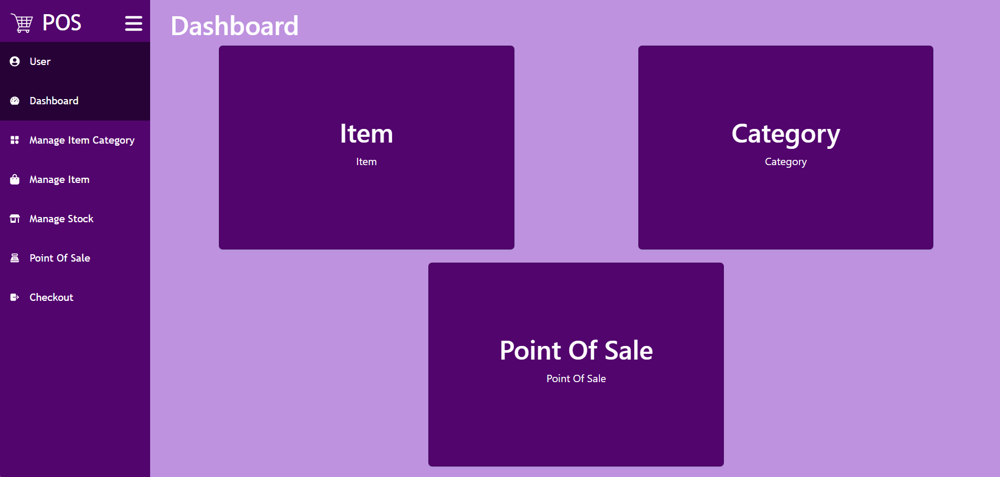
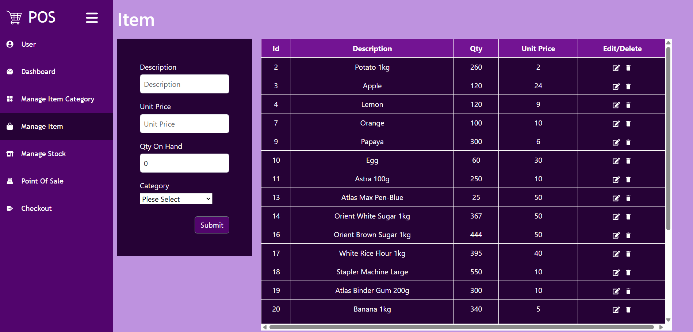
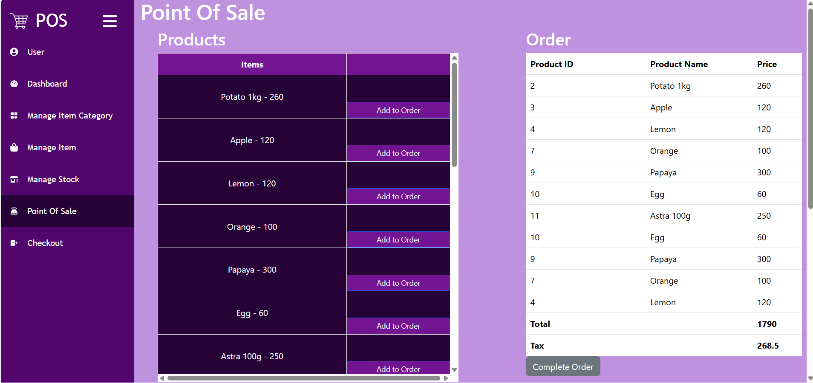

# 🛒 POS System - Frontend (React.js)

Welcome to the **Point of Sale (POS) System** frontend, designed with **React.js**. This system provides a seamless, modern, and responsive UI for managing sales, inventory, and customer transactions.

## 🌟 Features

- **User Authentication (JWT)**
- **Product & Item Management Dashboard**
- **Order & Billing System**
- **Modern & Responsive UI**
- **API Integration with Backend**

## 🛠️ Tech Stack

- **Frontend:** React.js, JavaScript
- **API Handling:** Axios

## 📸 Screenshots

<table>
  <tr>
    <td></td>
    <td></td>
  </tr>
  <tr>
    <td></td>
    <td></td>
  </tr>
</table>  

📌 *Screenshots are available in the `images` folder.*

## 🚀 Installation & Usage

# Clone the Repository
 ```bash
git clone https://github.com/ThasuniInduma/pos-frontend.git
cd pos-frontend
 ```

# Install Dependencies
 ```bash
npm install
 ```

# Start the Development Server
 ```bash
npm run dev
 ```

### 🌟 Thank You for Exploring POS System Frontend! 🚀
